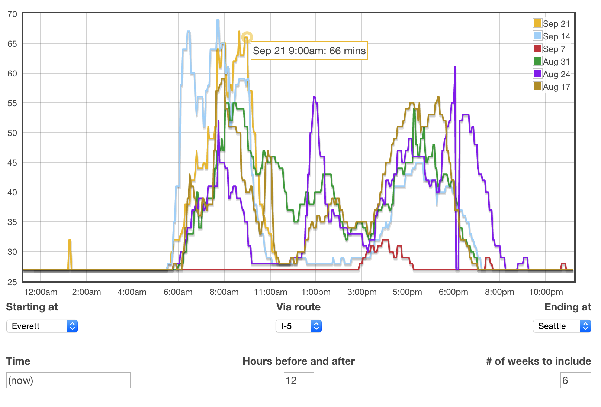

# seattle-traffic

[Historical graphs](http://traffic.brewingcode.net) of Seattle freeway
traffic, based on data from
[WSDOT](http://www.wsdot.com/traffic/traveltimes/default.aspx). The idea is
a quick glance at how travel times in the same timespan in the same day of
the week can show a pattern for how reliable the current trend is today.

### Settings

Name|Default|Notes
:---|------:|:----
Starting at             |     Seattle | City to start at
Via route               | I-5, SR 520 | Possible routes between them
Ending                  |     Redmond | City to end at, may change depending on `Starting at`
Time                    |   (now)     | Time to base the graph on, this time falls in the exact center
Hours before and after  |           6 | Number of hours to show before and after `Time`
\# of weeks to include  |           5 | Number of weeks back to fetch data for

### Setup

- make sure [node.js](http://nodejs.org) and [roots](http://roots.cx) are
  installed
- clone this repo down and `cd` into the folder
- run `npm install && roots watch`
